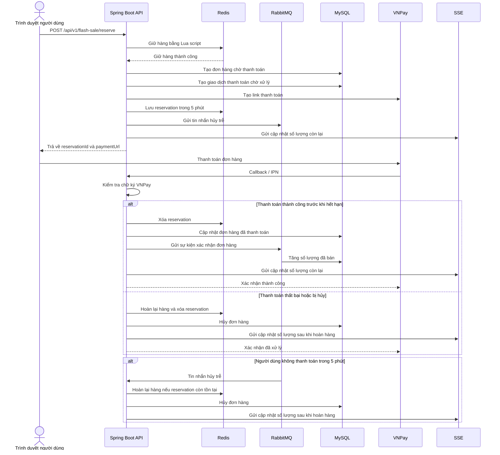

# Luồng Chính Flash Sale



## Giải thích luồng chính

### 1. Người dùng bấm mua sản phẩm flash sale

Frontend gọi API:

```http
POST /api/v1/flash-sale/reserve
```

Backend kiểm tra sản phẩm flash sale, chiến dịch còn active không, user có hợp lệ không, và số lượng mua có vượt giới hạn không.

### 2. Backend giữ hàng trong Redis

Backend dùng Lua script trong Redis để xử lý atomic:

- Kiểm tra còn hàng không.
- Kiểm tra user đã mua quá giới hạn chưa.
- Trừ số lượng tồn flash sale.
- Tăng số lượng đã giữ hoặc đã mua của user.

Việc này giúp nhiều người bấm mua cùng lúc nhưng không bị oversell.

### 3. Backend tạo đơn hàng chờ thanh toán

Nếu Redis giữ hàng thành công, backend tạo:

- `Order` với trạng thái chờ thanh toán.
- `OrderDetail` gắn với flash sale item.
- `PaymentTransaction` với trạng thái pending.

Sau đó backend tạo link thanh toán VNPay.

### 4. Backend lưu reservation và gửi RabbitMQ

Backend lưu reservation vào Redis trong 5 phút. Reservation chứa các thông tin như user, sản phẩm flash sale, `orderId`, số lượng và `paymentUrl`.

Đồng thời backend gửi một message hủy trễ vào RabbitMQ. Message này sẽ được xử lý sau 5 phút. Mục đích là nếu user không thanh toán kịp thì hệ thống tự hoàn lại hàng và hủy đơn.

### 5. Backend trả link thanh toán cho user

Backend trả về:

- `reservationId`
- `orderId`
- `paymentUrl`
- thời gian hết hạn

Frontend đưa user sang VNPay để thanh toán.

### 6. Nếu user thanh toán thành công đúng hạn

VNPay gọi callback hoặc IPN về backend.

Backend kiểm tra chữ ký VNPay, tìm reservation tương ứng với order, sau đó:

- Xóa reservation khỏi Redis.
- Cập nhật đơn hàng thành đã thanh toán.
- Chuyển trạng thái đơn sang chờ giao hàng.
- Gửi event vào RabbitMQ để tăng `soldQuantity` của flash sale item trong MySQL.
- Gửi SSE để frontend cập nhật số lượng còn lại realtime.

### 7. Nếu user thanh toán thất bại hoặc hủy thanh toán

VNPay vẫn gọi callback hoặc IPN về backend.

Backend sẽ:

- Hoàn lại stock trong Redis.
- Giảm lại số lượng mua hoặc giữ của user.
- Xóa reservation.
- Hủy đơn hàng.
- Cập nhật giao dịch thanh toán thất bại hoặc bị hủy.
- Gửi SSE để frontend cập nhật lại số lượng còn lại.

### 8. Nếu user không thanh toán trong 5 phút

RabbitMQ gửi message hủy trễ về backend.

Backend kiểm tra reservation còn tồn tại không. Nếu còn, backend:

- Hoàn lại stock trong Redis.
- Giảm lại số lượng mua hoặc giữ của user.
- Xóa reservation.
- Hủy đơn hàng.
- Gửi SSE cập nhật số lượng còn lại.

Tóm gọn: Redis chịu trách nhiệm giữ hàng nhanh và chống oversell, MySQL lưu đơn hàng/giao dịch, VNPay xử lý thanh toán, RabbitMQ xử lý hủy đơn tự động sau timeout và cập nhật số lượng đã bán bất đồng bộ, còn SSE dùng để cập nhật số lượng flash sale realtime cho frontend.
